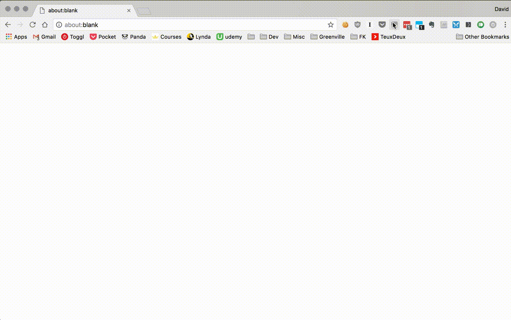

## Overview

This script takes a newline-delimited list of FreeCodeCamp profile URLs and returns a report on their progress as a newline-delimited list of tab-delimited percentages. 

## Installation

1. [Install Tampermonkey.](https://chrome.google.com/webstore/detail/tampermonkey/dhdgffkkebhmkfjojejmpbldmpobfkfo)
2. Navigate to the Utilities tab in Tampermonkey options.
3. Paste the following address into the input marked "URL" and click "Import" <https://raw.githubusercontent.com/dacohenii/fcc-progress/master/bulk-fcc-progress.js> 
4. Confirm the installation.

## Usage

_Note: This script sends a request for all these URLs essentially at the same time, so and hasn't been tested for more than ~30 at a time. Too many more and their serers might not appreciate it._

1. Copy a spreadsheet column (or newline-separated list) of URLs to be scraped to the clipboard.
    - empty cells / lines are okay and will be preserved on paste.
2. Invoke the script via the Tampermonkey menu.
3. A prompt should come up. Paste the addresses into the prompt and submit it.
4. At this point, it will start retrieving results.
5. A notification should appear to let you know the process is complete. When this happens select the top-left destination cell and paste the result. 

## Misc. Notes

The main functionality is in `bulk-fcc-progress.js`. 

`fcc-progress.js` scrapes a single profile and must be run directly from that page. 

This was developed and tested using Tampermonkey and Chrome 60. YMMV. 

The lessons are currently hard-coded in the files. This can be pulled dynamically in the future, but they don't seem to change too often.

Also, it's a web scraper, which is likely to break at some point when they change their website, but that's okay, becuase the next version will probably use an API, 
